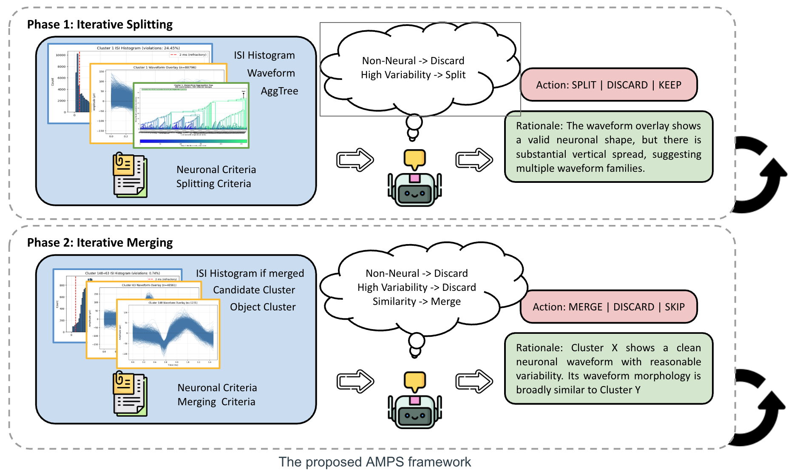

# SpikeSorting

A multimodal agent framework for iterative post-curation in spike sorting.

SpikeSorting studies whether VLM-based agents can assist or automate the expert curation process after an initial spike sorting pass. The project starts from initial clusters produced by hierarchical clustering or overclustering, then mimics how human experts inspect, split, merge, and discard clusters using waveform views, quality metrics, and iterative feedback.

The long-term goal is to build a scalable research pipeline for simulated and real extracellular recordings, supporting controlled MEArec-based benchmarking, expert-like action trajectory construction, teacher-student interaction, few-shot adaptation, memory-augmented curation, and future RL / continual learning across heterogeneous lab settings.

---

## Overview



The full curation pipeline proceeds in three main phases:

**Phase 0: Neuronal filtering.**  
A Neuronal Agent scans all initial clusters once and removes clusters that fail extracellular spike-shape criteria.

**Phase 1: Recursive split refinement.**  
A DFS-style traversal applies a Split Agent to large neuronal clusters. Clusters with high internal variability are recursively partitioned until they satisfy quality and consistency criteria.

**Phase 2: Merge and discard.**  
Small clusters are compared against large clusters by a Merge Agent. Matched clusters are merged into their corresponding neuronal units, while unmatched or non-neuronal clusters are discarded.

This design turns spike sorting post-curation into a long-horizon multimodal decision process: the agent observes waveform plots and diagnostic metrics, proposes an action, receives feedback, updates the cluster state, and continues until the recording is curated.

---

## What This Project Does

SpikeSorting currently supports two complementary settings:

1. **Real-data VLM curation**
   - Load MATLAB-based spike sorting outputs.
   - Render cluster-level diagnostic figures.
   - Run VLM agents for split / merge / discard decisions.
   - Evaluate agent decisions against curated labels or expert-derived targets.
   - Extend to Memory and online RL for adaptation to different channel settings and lab needs.

2. **Simulated benchmark pipeline**
   - Generate controlled extracellular recordings with MEArec-style simulation.
   - Produce initial overclustered states.
   - Construct canonical ground-truth curation actions.
   - Run teacher-student interaction trajectories.
   - Evaluate step-level action alignment and reasoning alignment.
   - Study adaptation across different channel settings, noise regimes, drift patterns, and lab-specific curation requirements.

---

## Repository Structure

```text
src/
  io/                 # Load MATLAB / MEArec data
  cluster/            # Cluster state management and split / merge operations
  agent/              # VLM API calls, prompts, runners, and teacher feedback
  eval/               # Metrics and evaluation utilities
  pipeline/           # Existing end-to-end pipeline utilities
  ablation/           # Ablation and comparison code

  simulate/           # Stage 1: MEArec generation and overclustering
  actions/            # Stage 2: Canonical GT action trajectory construction
  trajectories/       # Stage 3: Teacher-student interaction trajectories
  adapt/              # Stage 4: Few-shot / SFT adaptation
  alignment/          # Stage 5: Step-level action and reasoning alignment
  scale/              # Stage 6: Multi-setting sweep and aggregation

scripts/
  run/                # Existing run scripts
  finetune/           # Finetuning baselines
  aggregate/          # Result aggregation
  analysis/           # Analysis utilities
  plot/               # Plotting scripts
  demo/               # Demo scripts
  test/               # Unit-style evaluation scripts
```
